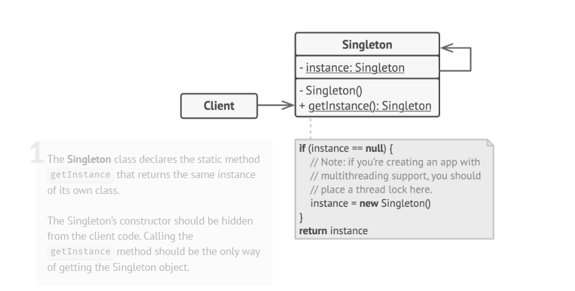

# Singleton Design Pattern

## 1. Definition
Singleton is a creational design pattern that:
* Ensures a class has only one instance
* Provides a global access point to that instance

## 2. Intent
* Control access to a shared resource (e.g., logger, database connection)
* Prevent creation of multiple objects of the same class
* Ensure consistent behavior and state across the application

## UML Diagram


## 3. Problems Solved

### a) Single Instance Guarantee
* Prevents multiple instances of a class
* Useful when:
   * Writing to a shared file
   * Managing a database connection
   * Centralized logging

### b) Global Access
* Allows access from anywhere in the application
* Safer alternative to global variables
* Prevents accidental overwriting of shared objects

Violates Single Responsibility Principle (Solves both instance control + global access)

## 4. Why Not Use Normal Constructors?
* Constructors always create new objects
* Singleton requires returning an existing instance
* Hence, constructor must be private

## 5. Core Implementation Steps
1. Private static field to store the instance
2. Private constructor to prevent instantiation
3. Public static method to return the instance
4. Instance created once and reused thereafter

## 6. Basic Singleton (Lazy Initialization)
```java
public class Logger {
    private static Logger instance;

    private Logger() {} // private constructor

    public static Logger getInstance() {
        if (instance == null) {
            instance = new Logger();
        }
        return instance;
    }

    public void log(String message) {
        System.out.println("Log: " + message);
    }
}
```

## 7. Real-World Analogy
* Government of a country
   * Only one official government at a time
   * Globally accessible authority

## 8. Use Case Example: Logger

### Problem with Traditional Approach
* Multiple `Logger` objects created
* Issues:
   * Memory waste
   * File access conflicts
   * Inconsistent logging
   * Harder debugging

### Singleton Solution
* One logger instance
* All logs go to the same destination
* Centralized, consistent logging

## 9. Applicability
Use Singleton when:
* Exactly one instance is required
* Need controlled global access
* Managing shared resources such as:
   * Logging systems
   * Database connections
   * Configuration managers
   * Thread pool managers

## 10. Multithreading Issue 

### Problem
* Multiple threads may create multiple instances simultaneously
* Leads to:
   * Race conditions
   * Broken Singleton guarantee

## 11. Thread-Safe Singleton (Double-Checked Locking)
```java
public class Logger {
    private static volatile Logger instance;

    private Logger() {}

    public static Logger getInstance() {
        if (instance == null) {
            synchronized (Logger.class) {
                if (instance == null) {
                    instance = new Logger();
                }
            }
        }
        return instance;
    }
}
```

### Key Concepts
* `volatile`: ensures visibility across threads
* `synchronized`: prevents concurrent creation
* Double check improves performance

## 12. Pros 
* Guarantees single instance
* Global access point
* Lazy initialization
* Controlled resource usage

## 13. Cons 
* Violates Single Responsibility Principle
* Can hide poor design
* Difficult to unit test
* Needs special handling in multithreading
* Static methods are hard to mock
